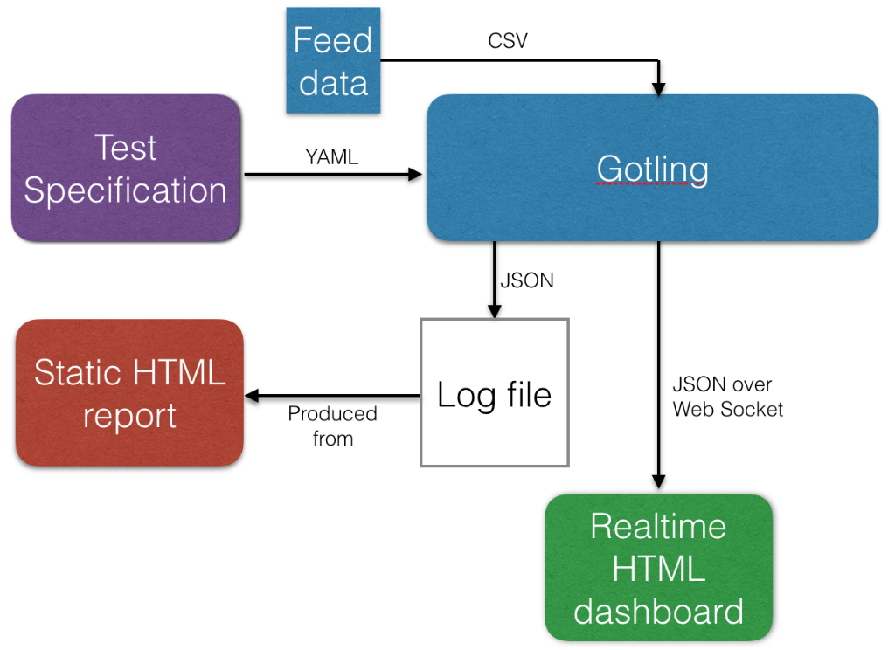
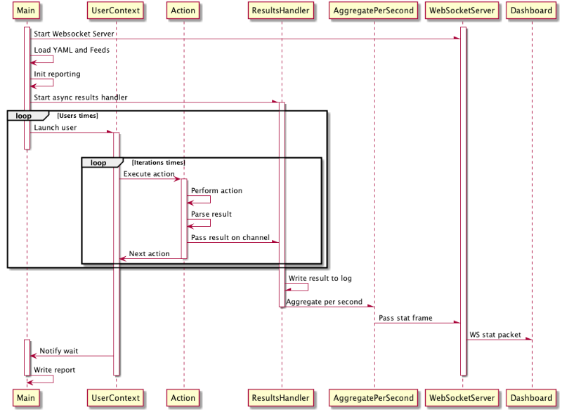
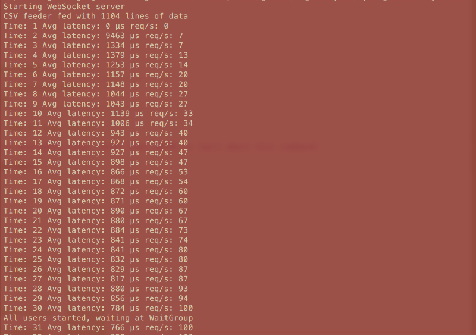
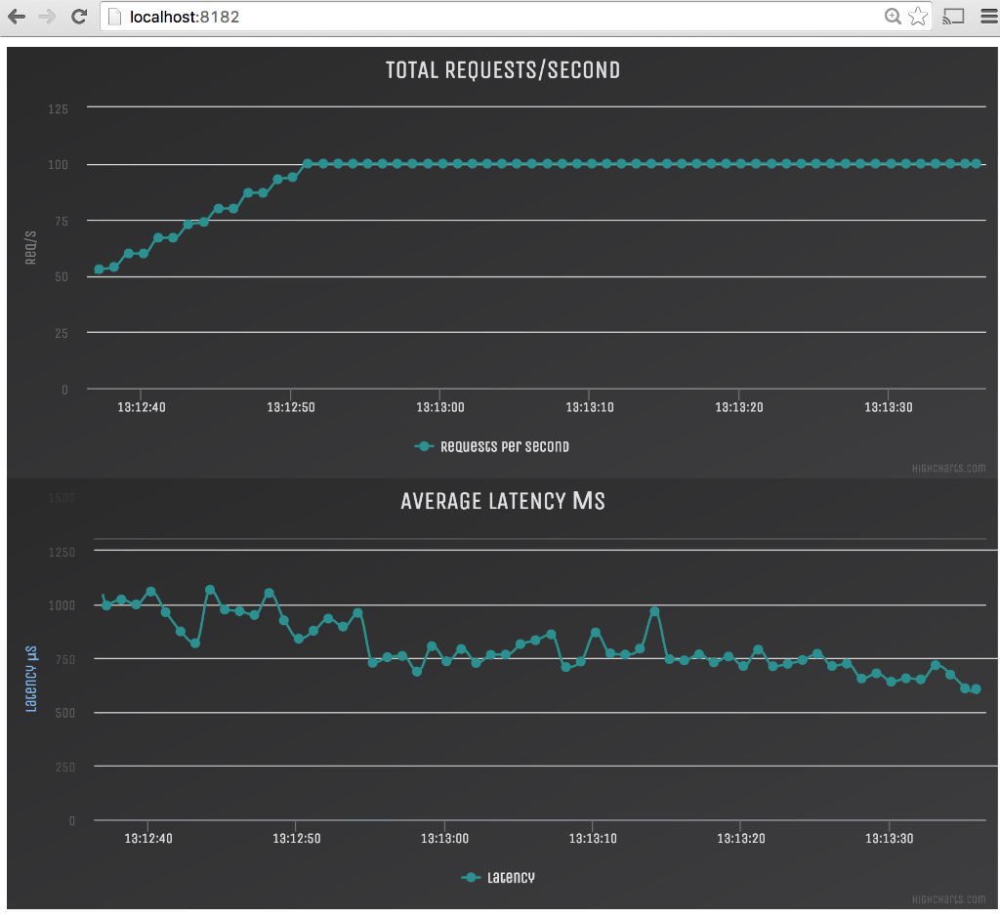
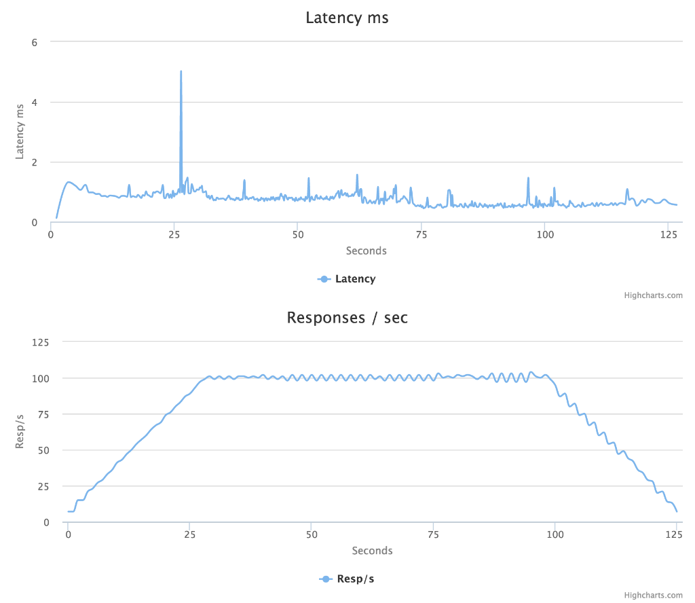

## URL

Article URL：https://callistaenterprise.se/blogg/teknik/2015/11/22/gotling/

GitHub repo：https://github.com/eriklupander/gotling


## Begin

In this blog post we’ll use [Golang](https://golang.org/), [YAML](http://yaml.org/) and [Highcharts](http://www.highcharts.com/) to create a load-test tool capable of simulating thousands of concurrent users borrowing many concepts from [Gatling](https://callistaenterprise.se/blogg/teknik/2015/11/22/gotling/gatling.io). It can also be read as an introduction to some core Golang features. With a huge pun intended, I’m calling this tool “[Gotling](https://github.com/eriklupander/gotling)”.


## RATIONALE

In another context, I’ve begun exploring the data ingestion capabilities of [Spring XD](http://projects.spring.io/spring-xd/). One of the key features of XD is its broad range of input sources - from HTTP, TCP, JMS, files, various databases etc to Twitter streams and Emails - all built on top of Spring Integration components.

To properly test how XD works under heavy load I needed a tool to provide more than just HTTP while being able to simulate thousands of requests per second on a developer laptop. I’ve used [JMeter](http://jmeter.apache.org/) and Gatling to simulate loads in the past, but neither seems to be the perfect fit for this use case. Gatling is more or less HTTP only and I’ve sometimes felt the Scala-based DSL not really being my cup of tea. Extremely powerful, but not always easy to grasp or express myself in. It’s been a while, but the last time I used JMeter its underlying threading model limited the number of concurrent users, needing load agents to scale. And in all honesty, I’m not too fond of the JMeter GUI. Given that I’ve been reading up on and experimenting with Googles “Golang” programming language, I decided that brewing my very own load test tool in Go could be a fun exercise!

#### A LIST OF THINGS I WOULD LIKE TO SEE IN MY OWN LITTLE LOAD-TEST TOOL:

- A declarative, simple and human-readable way of specifying the simulation, no coding skills should be needed.
- Fast simulation startup - a Gatling simulation often takes 5-10 seconds of build time before starting; I’d like close to immediate startup for the quickest possible feedback loop when developing load simulations.
- Runnable on a developer laptop, meaning low CPU/memory footprint. JVM-based solutions will seldom use less than 100-200 mb of RAM.
- Real-time dashboard. While I guess this may exist for Gatling through some plugin(?), I’d like a application-native real-time dashboard to monitor ongoing test execution.
- Native support for more than pure HTTP. At least TCP/UDP sockets.
- Optional: Realtime modification of test parameters - number of users, sleep durations etc. should be possible to change during test execution.

#### THINGS I WOULD LIKE BUT WON’T DO RIGHT NOW:

- Control statements. E.g. no conditionals or iterators in the “actions” sequence.
- Parallell or chained “simulations”
- Advanced feeders (csv only)
- Test Recording / Proxies
- GUI
- …more…

## HIGH-LEVEL ARCHITECTURE



Not very complex - a simulation consists of a single YAML specification, an optional feeder and outputs results to a log and aggregated per second over a Web Socket. The (unfinished) HTML reports actually aggregates results, graphs etc. on the fly using Javascript on the client side with the raw JSON log file as input.

## THE YAML-BASED TEST SPECIFICATION

Why YAML? My primary objective was to have tests specified in a human-readable but structured way. XML, no thanks. JSON - not the right tool in this context IMHO. A new DSL? Too much work.

YAML offers readbility, structure and is also well-known with parsers and writers for most modern programming languages.

The test specification is made up of simulation metadata such as number of users, rampup time and number of iterations to run the *actions* list. A series of actions makes up the actual load test work performed by each user. Gotling currently supports three actions:

- HTTP requests
- TCP packets
- Sleep

Let’s take a look at a sample test specification, each # is a comment about the feature on that line:

```
---
iterations: 5                  # Number of times to execute the actions per user
users: 100                     # Number of concurrent users
rampup: 10                     # Linear ramp-up time. E.g. ~10 per second in this case.
feeder:                        # Similar to Gatling feeders, a .csv file whose data can be fed to the context of each user
  type: csv                    # Format. Currently, only .csv is supported.
  filename: testdata.csv       # Goes into the /data folder

                               # A test specification consists of the metadata above and a number of actions. Currently supported actions are:
                               # sleep, http, tcp
actions:                       
  - sleep:                     # Defines a sleep action. Will make the current user iteration sleep for 'duration' seconds
      duration: 1              # Sleep duration in seconds
  - http:                                   # Defines a HTTP request action
      title: Get all courses                # Human readable title, used for aggregation in reports
      method: GET                           # HTTP method. GET, POST, PUT, DELETE should work.
      url: http://localhost:9183/courses    # URL to execute HTTP request against
      accept: json                          # Not in use right now. Only JSON can be handled at the moment)
      response:                             # Defines handling of response data (JSON only). Optional
        jsonpath: $[*].id+                  # Defines a JsonPath expression to use for extracting a single value from the response body
        variable: courseId                  # Store the extracted value in the current user's context with this variable name
        index: random # first, random, last. If more than one match for the JsonPath expression, pick the first, last or a random result.
  - sleep:
      duration: 3
  - http:
      title: Get course
      method: GET
      url: http://localhost:9183/courses/${courseId}      # Note how we use the variable 'courseId' extracted by the http action above.
      accept: json
      response:
        jsonpath: $.author+
        variable: author
        index: first # first, random, last
  - sleep:
        duration: 3        # After this sleep, the test will clear its variable context and do another
                           # iteration until (n) iterations have been executed
```

HTTP POST/PUT with bodies are also supported, including using variables from previous actions or feeders:

```
............
- http:
      method: POST
      url: http://localhost:9183/courses/${courseId}/poi
      body: '{"name":"Out of bounds starts","author":"${author}","latitude":${lat},"longitude":${lon},"type":"OOB"}'
      accept: json
```

The body data above needs to be wrapped in single quotes as JSON is a valid subset of YAML and won’t be handled as pure string unless quoted. As seen, we’ve used a number of variables. They can be populated either from previous HTTP responses or a feeder.

There are some samples ([here](https://github.com/eriklupander/gotling/blob/master/samples/spring-xd-demo.yml), [here](https://github.com/eriklupander/gotling/blob/master/samples/ltest00.yml)) in the github repository.

#### FEEDERS

I have shamelessy “borrowed” the concept of [feeders](http://gatling.io/docs/1.5.6/user_documentation/reference/feeders.html) from Gatling. We can imagine the ${courseId} coming from a previous HTTP action, while the other values comes from a .csv file which could look like this:

```
 author,lat,lon,type
 erilup,58.5435335,12.5453453,OOB
 grifyu,58.3224255,12.5545345,GRE
 ... more lines ...
```

E.g - title of the column in the csv files becomes the variable name.

## WHY GOLANG

Enough of the basics, let’s dive into Golang and why I think it was a really nice language to build all of this in: [Goroutines](https://gobyexample.com/goroutines) and [Channels](https://gobyexample.com/channels).

- A goroutine is a lightweight virtual “thread” starting at [8 kb of RAM](https://blog.cloudflare.com/how-stacks-are-handled-in-go/) apiece. Goroutines can be compared to Python [fibers](https://en.wikipedia.org/wiki/Fiber_(computer_science)) or the old Java 1.1 [green threads](https://en.wikipedia.org/wiki/Green_threads).
- A channel is a mechanism used for inter-goroutine communication. It is typed and comes in both blocking- and non-blocking (buffered) flavours.

Since Gotling mainly evolves about executing hundreds or thousands of virtual users without totally hogging all system resources, goroutines were an excellent match. The channel abstraction is mainly used for letting each virtual user (executed in a goroutine) report back results to a simulation-wide mechanism.

### CORE ARCHITECTURE

I’ve thrown together the sequence diagram below as an overview of the life of a Gotling simulation. It’s not 100% accurate and has a number of omitted participants for the sake of clarity. From a Golang perspective, all async invocations are functions called with the ‘[go](https://www.golang-book.com/books/intro/10)’ keyword making the specified function run concurrently in its own goroutine. The main async thresholds in the application are:

- Starting the Web Socket server
- Starting each ‘User’
- Reporting action outcome to the resultshandler (over a channel)
- Assembling per-second aggregation
- Transforming to JSON and sending over the Web Socket



### CODE SAMPLES

The snippet of code below showcases many core features of the Go language - the [spawnUsers](https://github.com/eriklupander/gotling/blob/master/src/github.com/eriklupander/gotling/gotling.go#L75) function runs on the main thread and launches “users” using the go keyword in a conccurent manner:

```go
// Function declaration. Takes a pointer to a TestDef struct and an array of interface{} as arguments.
// Note that one declares variables in golang with name followed by type.
func spawnUsers(t *TestDef, actions []Action) {  

    // Here we see the := operator in use - the compiler will later infer the type based on what the right-hand expression returns.
    // The make(chan ...) declares a channel of type HttpReqResult with a buffer size of 10000.
    resultsChannel := make(chan HttpReqResult, 10000)
    
    // Note use of 'go' keyword. This invokes the acceptResults function in a new goroutine, passing the resultsChannel
    // channel as argument.
    go acceptResults(resultsChannel)
    
    // WaitGroups is a simple counter-based lock mechanism. The "main" thread will block at wg.Wait() until the internal
    // counter in Wg == 0. This is so all concurrently executing goroutines can finish before the main program exists.
    wg := sync.WaitGroup{}
    
    // Calculate the number of seconds to wait until spawning the next user.
    var waitDuration float32 = float32(t.Rampup) / float32(t.Users)
    
    // For-statement. Nothing notable except the absence of parenthesises. Note how i := 0 is used instead of var i = 0
    for i := 0; i < t.Users; i++ {
        // Add 1 to the WaitGroup lock
        wg.Add(1)      
        
        // Generate a unique identifier > 10000
        UID := strconv.Itoa(rand.Intn(t.Users+1) + 10000)        
        
        // Spawn a goroutine the will execute actions for the current user.
        // Note that we pass a & reference to the WaitGroup. 
        go launchActions(t, resultsChannel, &wg, actions, UID)
        
        // Sleep the main thread to implement a linear ramp-up time.
        time.Sleep( time.Duration( int(1000*waitDuration) )*time.Millisecond)
    }
    fmt.Println("All users started, waiting at WaitGroup")
    
    // Will block here until wg count is 0
    wg.Wait()
}
```

For further clarification, this is the [launchActions](https://github.com/eriklupander/gotling/blob/master/src/github.com/eriklupander/gotling/gotling.go#L90) function called as a goroutine. Note how it ends with wg.Done() which notifies the waitgroup that a previous wg.Add(1) has finished.

```go
 func launchActions(t *TestDef, resultsChannel chan HttpReqResult, wg *sync.WaitGroup, actions []Action, UID string) {
     var sessionMap = make(map[string]string)
 
     for i := 0; i < t.Iterations; i++ {
 
         // Make sure the sessionMap is cleared before each iteration - except for the UID which stays
         cleanSessionMapAndResetUID(UID, sessionMap)
 
         // If we have feeder data, pop an item and push its key-value pairs into the sessionMap
         feedSession(t, sessionMap)
 
         // Iterate over the actions. Note the use of the Execute method on the action interface, command-pattern style.
          for _, action := range actions {
 		    	if action != nil {
 			    	action.Execute(resultsChannel, sessionMap)
 			    }
          }
     }
     wg.Done()
 }
```

I kind of like the duck-typed implicit interfaces of Golang. Here’s the [Action](https://github.com/eriklupander/gotling/blob/master/src/github.com/eriklupander/gotling/action.go) interface declaration:

```go
type Action interface {
	Execute(resultsChannel chan HttpReqResult, sessionMap map[string]string)
}
```

And here is the [HttpAction](https://github.com/eriklupander/gotling/blob/master/src/github.com/eriklupander/gotling/httpaction.go) struct that implicitly implements the Action interface by the declaration of a matching Execute(..) method:

```go
// struct. Note the YAML-specific formatters. The struct fields needs capital first letters, controls public/private scope
type HttpAction struct {
	Method string `yaml:"method"`
	Url string `yaml:"url"`
	Body string `yaml:"body"`
	Accept string `yaml:"accept"`
	Title string `yaml:"title"`
	ResponseHandler HttpResponseHandler `yaml:"response"`
}

// This is how we attach a Method to the HttpAction struct. Since its signature matches the Action interface, 
// it is now an implicit implementor. 
func (h HttpAction) Execute(resultsChannel chan HttpReqResult, sessionMap map[string]string) {
    // Semi-ugly, calls globally scoped method declared elsewhere
	DoHttpRequest(h, resultsChannel, sessionMap)    
}
```

It’s possible to assert in runtime that a struct implicitly implements a given interface:

```go
var _ Action = (*HttpAction)(nil)
```

The above will yield an error if the assignment is not possible. Note the use of the underscore identifier - it’s used as a “ignore me” variable name in golang. Golang has the nice but sometimes annoying feature that unused variables or imports yields compile errors unless the assignment is to the underscore “blank” identifier. Noticed the multi-value returns often seen in the codebase? Example:

```go
resp, err := client.Do(req)   // execute Http request
```

The first value in this example is a pointer to the Http response and the second is the [error](http://blog.golang.org/error-handling-and-go) type. If you do not care about possible errors, the _ identifier can be used to ignore whatever the called function returns. Remember, in golang all declared identifiers *must* be used or ignored using the _ identifier, otherwise it won’t compile. This code won’t compile since the declared *err* isn’t used:

```go
func doRequest(str string) {
    resp, err := doSomething(str)
    fmt.Printf("%s", resp)
}
```

#### ASSEMBLING RESULT DATA

Results are HTTP-only this far, TCP/UDP results support will be added eventually. Anyway - we make heavy use of Golang Channels to pass the result of each HTTP invocation back to a global results aggregator. The [code](https://github.com/eriklupander/gotling/blob/master/src/github.com/eriklupander/gotling/httpreq.go) below is slighly simplified to keep it readble:

```go
func DoHttpRequest(httpAction HttpAction, resultsChannel chan HttpReqResult, sessionMap map[string]string) {
    req := buildHttpRequest(httpAction, sessionMap) // factory method for building a request.
    client := &http.Client{}
    start := time.Now() // start request timer
    resp, err := client.Do(req) // Exeute request.
    if err != null {
        panic(err)
    }
    elapsed := time.Since(start) // capture time spent
    responseBody, _ := ioutil.ReadAll(resp.Body) // get the body

    defer resp.Body.Close() // defer makes sure the function is executed
                            // after the current method has finished.

    httpReqResult := buildHttpResult(len(responseBody), resp.StatusCode,
                                 elapsed.Nanoseconds(), httpAction.Title)

    resultsChannel <- httpReqResult // Pass the result to the resultsChannel
 }
```

Taken from the code that builds, executes and assembles the request outcome, the snippet above showcases two cool Golang concepts - [defers](https://gobyexample.com/defer) and passing a message to a [channel](https://gobyexample.com/channels). The defer is a bit like a Java finally that doesn’t need to be declared and that will be executed after the current method scope has been popped out from the call stack. The arrow operators <- and -> are used with channels to either denote passing a message to a channel (<-) or waiting for a message to be passed onto a channel. The [receiving end](https://github.com/eriklupander/gotling/blob/master/src/github.com/eriklupander/gotling/httpresulthandler.go#L51) of the message passed above looks like this:

```go
func acceptResults(resChannel chan HttpReqResult) {
    perSecondAggregatorChannel := make(chan *HttpReqResult, 5)
    go aggregatePerSecondHandler(perSecondAggregatorChannel)
    for {
      select {
        case msg := <-resChannel:
          perSecondAggregatorChannel <- &msg
          writeResult(&msg) // sync write result to file for later processing.
        default:
           time.Sleep(100 * time.Microsecond)
        }
     }
  }
```

During simulation startup, the acceptResults function was called as a goroutine:

```go
resultsChannel := make(chan HttpReqResult, 10000) // buffered channel
go acceptResults(resultsChannel)
```

E.g. the resultsChannel was created as a buffered channel with space for 10000 messages. The acceptResults function then declares another channel and launches a goroutine that we will pass results to for per-second aggregation that will eventually be passed in aggregated form to connected Web Sockets. The writeResult(&msg) function writes the result JSON to the log file. Note that we pass a reference (or to be more exact, [a copy of a pointer](https://golang.org/doc/faq#pass_by_value)) to the writeResult function and perSecondAggregator channels to avoid unecessary copying of the entire struct.

The for { } statement without conditionals is exactly what it looks like - an eternal loop. The select statement within is similar to a switch statement but used for working with channels. For each 100 microsecond iteration, the for loop will either accept a message if such is waiting in the case msg := <-resChannel statement or if no message exists in the channel at that point in time, the goroutine will sleep for the mentioned 100 microseconds.

Why sleep, why 100 microseconds? I suggest reading up on buffered vs unbuffered channels, but basically this offered a good balance between throughput (up to 10000 result messages per second) and CPU use. Using 10 micro second sleep or unbuffered (e.g. blocking) channels yielded excessive CPU use (context switching) or horrible throughput respectively.

## RUNNING A TEST

Given that you have cloned the Gotling repository, have the Go SDK installed and a HTTP/TCP service to test, a Gotling simulation can be started from the command line:

```
go run src/github.com/eriklupander/gotling/*.go samples/spring-xd-demo.yml
```

A binary can be built as well:

```
go build src/github.com/eriklupander/gotling/*.go
```

With a compiled binary, it should be sufficient to use (Linux/OS X example):

```
./gotling samples/spring-xd-demo.yml
```

The test will output some basic stats in the console window:



Note that the rampup time, in this case 30 seconds, evenly distributes user startup.

### LIVE DASHBOARD

The “work-in-progress” live dashboard based on Web Sockets and [Highcharts](http://www.highcharts.com/) can be accessed using a HTML5-capable web browser by pointing it to:

```
http://localhost:8182
```



Technically, the simulation will launch a HTTP server on port 8182 that serves the [static HTML/JS](https://github.com/eriklupander/gotling/blob/master/static/index.html) resources and also provides a Web Socket at http://localhost:8182/start

```go
ws = new WebSocket("ws://localhost:8182/start");
ws.onmessage = function(e) {
    var statFrame = JSON.parse(e.data); // from json string to JS object
    var x = (new Date()).getTime(); // current time
    
    // Add data points to Highcharts
    series1.addPoint([x, statFrame['reqs']], true, true); 
    series2.addPoint([x, statFrame['latency']], true, true);
};
```

In the Golang program, each time a browser connects to the WS server the connection is added to a simple slice containing WS connections. The [code](https://github.com/eriklupander/gotling/blob/master/src/github.com/eriklupander/gotling/wsserver.go#L21) that assembles the text frame sent over the Web Socket each second looks like this:

```go
func BroadcastStatFrame(statFrame StatFrame) {
    for index, wsConn := range connectionRegistry {  // Iterate over conns
	    serializedFrame, _  := json.Marshal(statFrame) // struct to bytes
	    err := wsConn.WriteMessage(1, serializedFrame) // Write frame
	    if err != nil {
		    // Detected disconnected channel. Need to clean up.
            fmt.Printf("Could not write to channel: %v", err)
            wsConn.Close()
            Remove(index) // Removes the WS connection from the registry
	    }
    }
}
```

### REPORTS

At time of writing this, the reports aren’t finished. A WIP sample:



## FOOTPRINT COMPARISON TO GATLING

I decided to exercise a simple HTTP / JSON / MongoDB server I have previously written in Go using identical Gatling and Gotling load tests. I’d look at throughput, CPU utilization, memory use and stability. The test runs with 8000 concurrent users performing two HTTP GET with 3 seconds between each, e.g. ~2700 requests per second. The first GET returns a JSON listing of available objects and second GET fetches one of those objects using jsonPath variable extraction of a random id performed on the first response.

Both load test tools handles the amount of requests just fine, but going much higher on either makes the HTTP server crash with “out of files” even though I had bumped maxfiles to ‘unlimited’ on my MacBook Pro.

Env: MacBook Pro OS X 10.11, Core i7@2.5 ghz, 16 GB RAM

- Gatling: 200-280 mb RAM, ~90-110% CPU load.
- Gotling: 43 mb RAM, 90-100% CPU load.

This is a rather unscientific comparison using the Activity Monitor on OS X 10.11, especially given my naive Go implementation. CPU usage seems to be quite even while the Go program uses less than 1/4th the memory compared to the JVM-based Gatling tool.

### FINAL WORDS

The Gotling tool is something I have written for fun and is essentially my first proper Golang program. It meets most of the basic requirements I set up for myself and I’ve had lots of fun writing both the program and this blog post. The codebase really needs some more love - use of packages, tests etc. are just two of many things that should be improved upon.

I hope you enjoyed reading about this endeavour. Please do not hesitate to use the comments.